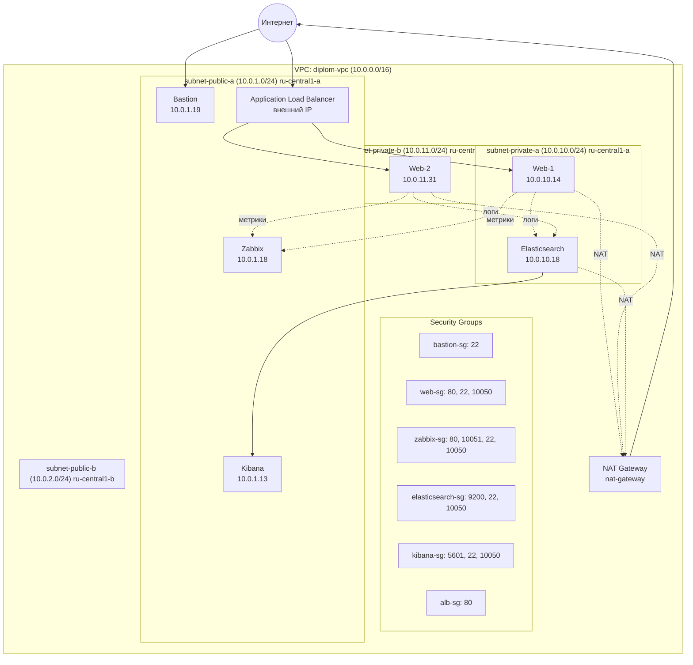

# Дипломная работа по профессии «Системный администратор»
# Искрянов Александр Владимирович

## Задача

Ключевая задача — разработать отказоустойчивую инфраструктуру для сайта, включающую мониторинг, сбор логов и резервное копирование основных данных. Инфраструктура должна размещаться в Yandex Cloud и отвечать минимальным стандартам безопасности.

## Использованные инструменты

- **Terraform** — управление инфраструктурой (IaC)
- **Ansible** — конфигурация серверов
- **Yandex Cloud** — облачная платформа
- **Nginx** — веб-сервер
- **Zabbix** — мониторинг
- **Elasticsearch + Kibana + Filebeat** — сбор и визуализация логов (ELK-стек)
- **Application Load Balancer** — балансировка трафика

## Архитектура

## Основа архитектуры

### Виртуальные машины
|Название        |ВМ          |Публичный IP        |Приватный IP         |Доступ из веб                          |Назначение|
|:-:|:-:|:-:|:-:|:-:|:-:|
|Web-1|         web-1|          нет|           	    10.0.10.14|                                          |Nginx + Filebeat + Zabbix Agent|
|Web-2|       	web-2|	        нет|	            10.0.11.31|                                       |   Nginx + Filebeat + Zabbix Agent|
|Bastion|	    bastion|	    84.252.130.131|   	10.0.1.19|                                        |       Bastion host (Jump host)|
|Zabbix	|       zabbix|	        51.250.6.191|	    10.0.1.18 |        <http://51.250.6.191/zabbix/>  |     Zabbix Server + Frontend + PostgreSQL|
|Kibana	|       kibana|	        51.250.77.163|	    10.0.1.13 |        <http://51.250.77.163:5601>    |     Kibana|
|Elasticsearch|	elasticsearch|	нет|         	    10.0.10.18|                                          |Elasticsearch + Zabbix Agent|

Конфигурация ВМ:2 ядра, 2–4 ГБ RAM, 10–15 ГБ HDD, Ubuntu 22.04 LTS

### Балансировка

- Target Group: `web-target-group` (web-1 + web-2)
- ALB: `web-alb` (слушает по 80 порту, публичный IP `<http://158.160.187.67>`)

### Резервное копирование

Snapshot Schedule: `daily-snapshot-schedule`, ежедневно в 02:00 UTC, retention 7 дней, на все 6 дисков.

### Структура сети

## Развёртывание

Работа проводилась на **Yandex Cloud**.
Заранее было подготовлено облако и каталог, сервисный аккаунт с ролью `editor`, авторизованный ключ сервисного аккаунта (`key.json`)
На локальной машине испльзовался VS Code, как основной инструмент, с установленным Terraform и был создан SSH-ключ для доступа к ВМ.

### 1. Настройка переменных
На основе terraform.tfvars.example был создан terraform.tfvars в котором были описанны переменные, которые не должны были попасть на Git

### 2: Развёртывание инфраструктуры

>terraform init
>terraform plan
>terraform apply

### 3: Настройка серверов через Ansible

**Ansible** установил сервере **Bastion** , что позволяет работать уже внутри созданной закрытой сети. Также это облегчаетс работу с ключами.\
Процедура установки - тривиальная.

Создал [`~/ansible/inventory.ini`](https://github.com/DefAKAAlex/Diplom/tree/main/ansible/inventory.ini)

На ВМ **Bastion** в [`~/ansible/`](https://github.com/DefAKAAlex/Diplom/tree/main/ansible/) создаю следующие плейбуки:

1. Nginx на web-серверах\
`ansible-playbook web.yml`

2. Zabbix Server\
`ansible-playbook zabbix-server.yml`

3. Zabbix Agent на всех ВМ\
`ansible-playbook zabbix-agent.yml`

4. Elasticsearch\
`ansible-playbook elasticsearch-install.yml`

5. Kibana\
`ansible-playbook kibana-install.yml`

6. Filebeat на web-серверах\
`ansible-playbook filebeat-install.yml`

## Проверка

Результатом работы плейбуков появилась следующая структура:

* Сайт (ALB)	<http://158.160.187.67>
* Zabbix	<http://51.250.6.191/zabbix/> (Admin / zabbix)
* Kibana	<http://51.250.77.163:5601>

### Web - Сайт

### Проверка работы балансировки:

> for i in {1..20}; do curl -s http://158.160.187.67 | grep "Served by"; done

### Проверка мониторинга (Zabbix)

Все 6 ВМ добавлены в Zabbix и мониторятся через Zabbix Agent:\
> bastion, web-1, web-2, zabbix, elasticsearch, kibana

К каждому хосту привязан шаблон `Linux by Zabbix agent`

### Логи

Nginx (access.log, error.log)\
    │ \
Filebeat (на web-1, web-2)\
    │ \
Elasticsearch (10.0.10.18:9200)\
    │ \
Kibana (51.250.77.163:5601)

### Безопасность

* Bastion host — единственная ВМ с публичным SSH-доступом (порт 22) \
* Web-серверы — без публичного IP, доступ только через ALB\
* Elasticsearch — без публичного IP, доступ только из приватных подсетей\
* Security Groups — ограничение входящего трафика по портам и подсетям\
* NAT Gateway — исходящий интернет для приватных подсетей\
Естествено, все важные и секретные данные, такие как terraform.tfvars и key.json в .gitignore

## Описание проекта

|:-:|:-:|
|provider.tf                 |Провайдер Yandex Cloud|
|variables.tf                |Переменные|
|terraform.tfvars.example    |Пример переменных|
|network.tf                  |VPC, подсети, NAT|
|security.tf                 |Security Groups|
|instances.tf                |6 ВМ|
|alb.tf                      |Application Load Balancer|
|snapshots.tf                |Snapshot Schedule|
|outputs.tf                  |Outputs|
|ansible/                    |папка с плейбуками|
